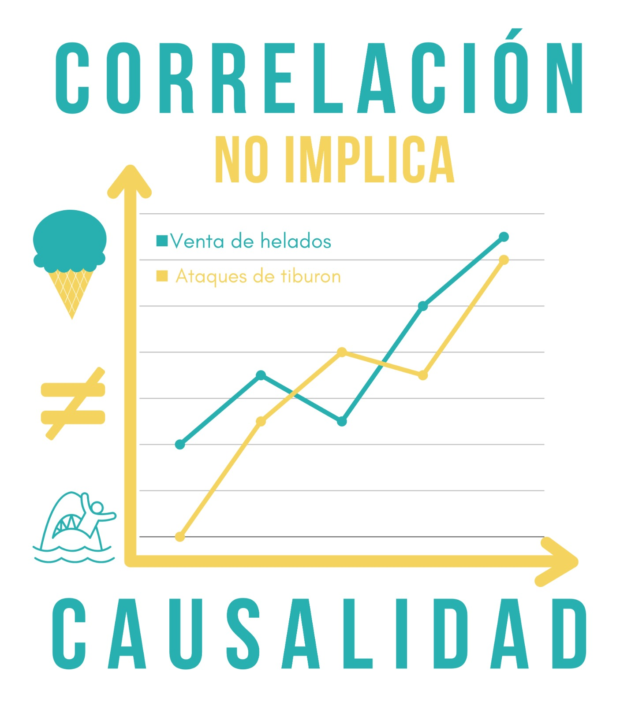
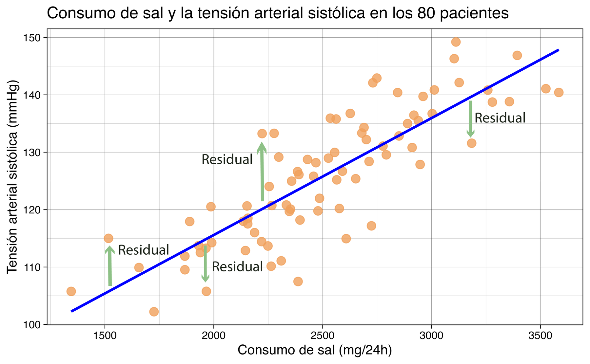
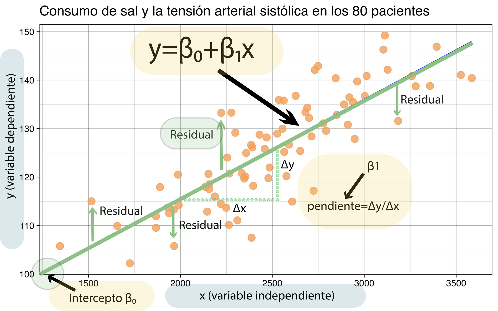
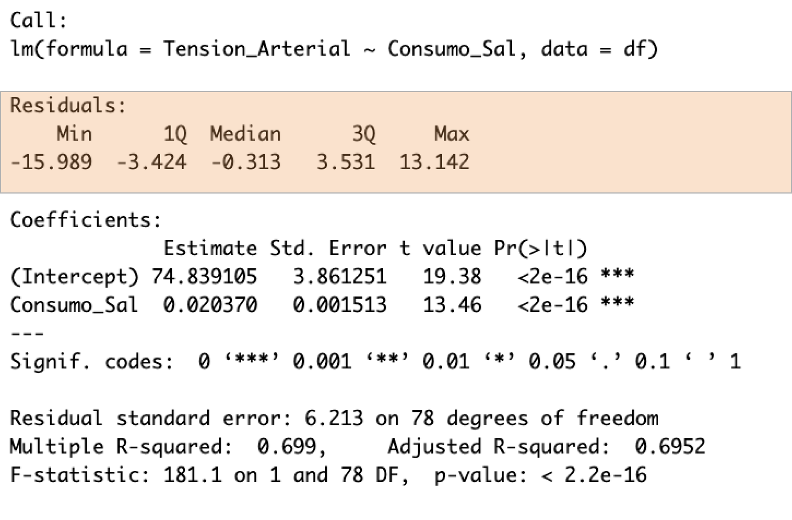
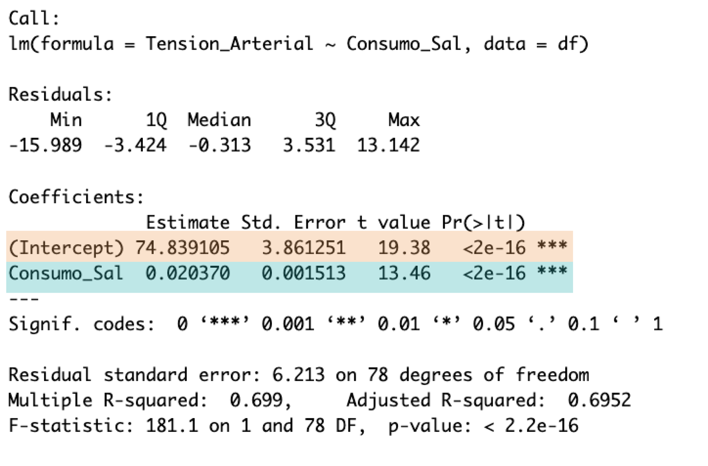
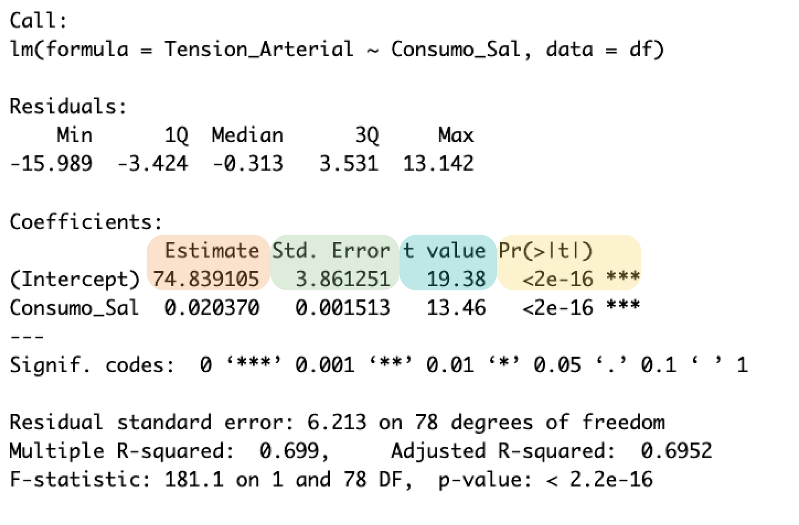
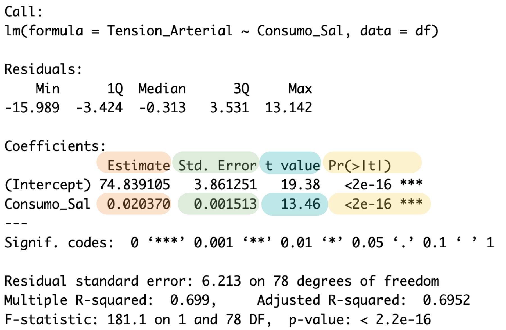
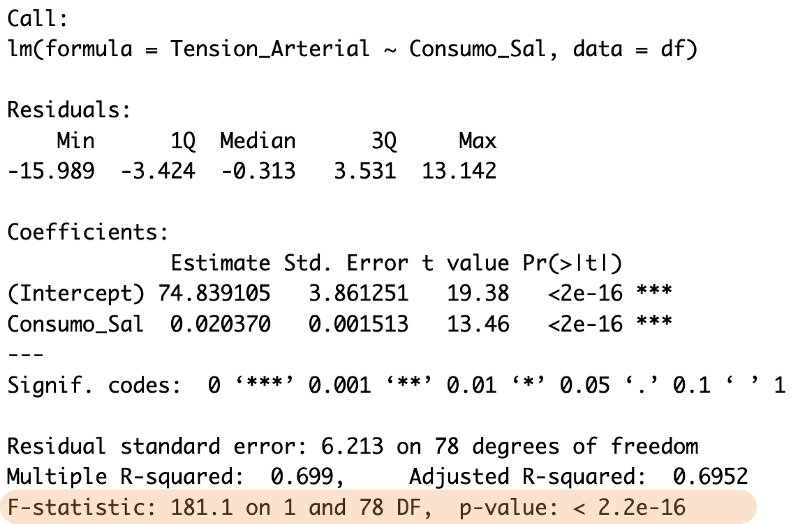

```{r}
#| label: setup
#| include: false
# Paquetes para toda la sesión (se cargan también en la diapositiva de "Paquetes")
library(ggplot2)
library(performance)
library(see)        # performance usa 'see' para dibujar check_model()
library(readxl)
options(scipen = 999, digits = 5)
theme_set(theme_linedraw(base_size = 14))
```

## Objetivos de la sesión

Al terminar la sesión, usted podrá:

1.  Distinguir entre correlación y regresión.
2.  Ajustar una **regresión lineal simple** en `R` y leer cada parte de su salida.
3.  Construir e interpretar la **tabla ANOVA** de la regresión.
4.  **Diagnosticar** un modelo con la librería `performance`.
5.  **Interpretar coeficientes** y otros componentes de la **regresión lineal simple**


## Ruta del tema 05: Modelos lineales

| Parte | Contenido | ¿Qué intentamos responder? |
|-------------------|---------------------------|--------------------------|
| **1 (hoy)** | Correlación vs. regresión, RLS, ANOVA, diagnóstico, interpretación | ¿Cómo cambia *y* cuando cambia *x*? |
| 2 | Regresión múltiple, variables categóricas (*dummy*), ajuste por covariables, selección de variables | ¿Cuál es el efecto de *x* **manteniendo constantes** las demás? |
| 3 | Interacciones y modificación del efecto | ¿El efecto de *x* **depende** de *z*? |
| 4| Algoritmos para la selección de variables | ¿Qué algoritmos podrían ayudar con la selección de variables|

<br>

::: clave
Todo lo que veamos hoy es sienta las bases para las partes 2,3, 4.
:::

## Paquetes y datos

```{r}
#| label: paquetes
#| eval: false
# Instalar solo una vez
install.packages(c("ggplot2", "performance", "see", "readxl", "car"))
```

```{r}
#| label: datos
# Cargar librerías
library(ggplot2)      # gráficos
library(performance)  # diagnóstico de modelos
library(see)          # gráficos de performance

# Importar base de datos. Guardela en su carpeta de Bases
df <- read.csv("Bases/sal_tension_arterial.csv")
str(df)
```

::: small
80 pacientes: consumo de sal promedio de 10 días (mg/24 h) y tensión arterial sistólica (mmHg) [@perezguerrero2024bioestadistica].
:::

# 1. Correlación vs. regresión {background-color="#1f4e79"}

## Diferencias entre correlación y regresión

::: columns
::: {.column width="50%"}
### Correlación

-   ¿Las dos variables **varían juntas**?
-   ¿Qué tan **fuerte** y en qué **dirección**?
-   Relación **simétrica**: $r_{xy} = r_{yx}$
:::

::: {.column width="50%"}
### Regresión

-   ¿**Cuánto cambia** *y* cuando *x* cambia una unidad?
-   ¿Qué valor de *y* **predigo** para un *x* dado?
-   Relación **asimétrica**: $y \sim x \neq x \sim y$
:::
:::


## Diferencias entre correlación y regresión

::: columns
::: {.column width="50%"}
### Correlación

-   **Sin unidades**, $-1 \le r \le 1$
-   No distingue variable dependiente de independiente
:::

::: {.column width="50%"}
### Regresión


-   Coeficientes **en unidades** de las variables
-   Exige definir **respuesta** (*y*) y **predictor** (*x*)
:::
:::

::: pregunta
¿El consumo de sal **se asocia** con la tensión arterial? ¿Qué técnica usaría? Y para ¿**Cuántos mmHg** aumenta la tensión por cada gramo de sal?
:::

## Correlación en R
::: columns
::: {.column width="40%"}

```{r}
#| label: cor-test
# Coeficiente de correlación de Pearson con su prueba de hipótesis
cor.test(df$Consumo_Sal, df$Tension_Arterial)
```
:::
::: {.column width="60%"}
-   $r = 0.836$: asociación lineal **positiva y fuerte**.
-   Pero... ¿cuántos mmHg por mg de sal? **La correlación no lo dice.**
-   Hasta el momento solo hemos indenficado que hay una relación positiva fuerte entre el consumo de sal y tensión arterial.
-   No sabemos cuanto afecta la tensión arterial el consumo de sal
:::
:::

## La regresión sí responde "¿cuánto?"

```{r}
#| label: lm-intro
# y ~ x : tensión arterial en función del consumo de sal
coef(lm(Tension_Arterial ~ Consumo_Sal, data = df))

# x ~ y : NO es el mismo modelo
coef(lm(Consumo_Sal ~ Tension_Arterial, data = df))
```

-   Con $y \sim x$: cada mg/24 h adicional → **+0.0204 mmHg** en promedio.
-   Con $x \sim y$ la pendiente **no** es $1/0.0204 = 49.1$, es $34.3$. La regresión **no es simétrica**: minimiza errores en la dirección de *y*.

## ¿Cómo se conectan $r$ y $\beta_1$?

$$
\hat\beta_1 = r \cdot \frac{s_y}{s_x} \qquad\qquad R^2 = r^2 \;(\text{solo en regresión simple})
$$

```{r}
#| label: r-beta
r  <- cor(df$Consumo_Sal, df$Tension_Arterial)
sy <- sd(df$Tension_Arterial)
sx <- sd(df$Consumo_Sal)

r * sy / sx   # pendiente de la regresión
r^2           # coeficiente de determinación
```

::: clave
Si estandarizamos ambas variables (media 0, DE 1), la pendiente **es** $r$. La correlación es una regresión "sin unidades".
:::

## Correlación no implica causalidad

::: columns
::: {.column width="50%"}
{width="95%"}
:::

::: {.column width="50%"}
{width="72%"}
:::
:::


## ... y la regresión **tampoco**, por sí sola

-   `lm()` estima **asociaciones condicionales**, no efectos causales.
-   La interpretación causal depende del **diseño** (aleatorización, temporalidad, control de confusores), no de la técnica.
-   En un estudio observacional escribimos: *"se **asoció** con..."*, *"por cada unidad... se **espera en promedio**..."* [@denis2020univariate].


## Siempre grafique. Cuarteto de Anscombe

```{r}
#| label: anscombe
#| echo: false
#| fig-height: 4.2
# Cuatro conjuntos con la misma r, misma recta... y datos muy distintos
ans <- data.frame(
  x = c(anscombe$x1, anscombe$x2, anscombe$x3, anscombe$x4),
  y = c(anscombe$y1, anscombe$y2, anscombe$y3, anscombe$y4),
  conjunto = rep(paste("Conjunto", 1:4), each = 11)
)
ggplot(ans, aes(x, y)) +
  geom_point(col = "#F0A05B", size = 3) +
  geom_smooth(method = "lm", se = FALSE, col = "blue") +
  facet_wrap(~conjunto, ncol = 4)
```

```{r}
#| label: anscombe-r
# Misma correlación en los 4 conjuntos
round(c(cor(anscombe$x1, anscombe$y1), cor(anscombe$x2, anscombe$y2),
        cor(anscombe$x3, anscombe$y3), cor(anscombe$x4, anscombe$y4)), 3)
```

::: small
Mismo $r$, misma recta ($\hat y = 3 + 0.5x$), mismo $R^2$ [@anscombe1973graphs]. Solo el conjunto 1 es apropiado para una regresión lineal.
:::

# 2. Regresión lineal simple {background-color="#1f4e79"}

## El problema

> Un grupo de investigadores quiere evaluar el efecto del **consumo diario de sal** (mg/24 h) sobre la **tensión arterial sistólica** (mmHg) en 80 pacientes. Promediaron 10 días de mediciones [@perezguerrero2024bioestadistica].


## Antes de resolver el problema

Antes de ajustar una regresión, pregúntese:

-   ¿Mi objetivo **requiere** una regresión? ¿Explicar, predecir, ajustar?
-   ¿Tengo claro quién es *y* (respuesta) y quién es *x* (predictor)?
-   ¿Hay evidencia gráfica de relación **lineal**?
-   ¿Las observaciones son **independientes**?
-   ¿Existe plausibilidad biológica?
[@perezguerrero2024bioestadistica]

::: clave
Si no puede responder estas preguntas, no haga una regresión. No es que no sea necesaria, simplemente puede que aún no sea tiempo. 
:::

## Primero, el gráfico

```{r}
#| label: fig-scatter
#| fig-height: 4.3
df |>
  ggplot(aes(x = Consumo_Sal, y = Tension_Arterial)) +
  geom_point(col = "#F0A05B", alpha = 0.8, size = 3) +
  labs(x = "Consumo de sal (mg/24h)",
       y = "Tensión arterial sistólica (mmHg)")
```

## El modelo

$$
y_i = \underbrace{\beta_0 + \beta_1 x_i}_{\text{parte determinística}} + \underbrace{\varepsilon_i}_{\text{parte aleatoria}}, \qquad \varepsilon_i \sim N(0, \sigma^2)
$$


| Símbolo | Nombre | En el ejemplo |
|---------------|-------------------|----------------------------------------|
| $y_i$ | Variable dependiente (respuesta) | Tensión arterial (mmHg) |
| $x_i$ | Variable independiente (predictor) | Consumo de sal (mg/24 h) |
| $\beta_0$ | Intercepto | Tensión esperada cuando la sal = 0 |
| $\beta_1$ | Pendiente | Cambio esperado en *y* por 1 unidad de *x* |
| $\varepsilon_i$ | Error | Lo que el modelo no explica |
| $\sigma^2$ | Varianza del error | Qué tan dispersos están los puntos alrededor de la recta |

::: small
Los $\beta$ son **parámetros** poblacionales; con la muestra obtenemos **estimaciones** $\hat\beta_0, \hat\beta_1$ [@denis2020univariate], [@perezguerrero2024bioestadistica].
:::

## ¿Por qué *esa* recta y no otra?

```{r}
#| label: fig-lineas
#| echo: false
#| fig-height: 4.5
# Recta de mínimos cuadrados (azul) vs. otras rectas posibles (rojo)
p <- df |>
  ggplot(aes(x = Consumo_Sal, y = Tension_Arterial)) +
  geom_point(col = "#F0A05B", alpha = 0.8, size = 3) +
  geom_smooth(method = "lm", col = "blue", se = FALSE, linewidth = 1.3) +
  labs(x = "Consumo de sal (mg/24h)", y = "Tensión arterial sistólica (mmHg)")
interceptos <- c(56.128, 61.128, 66.128, 71.128, 76.128)
pendientes  <- c(0.0152, 0.0182, 0.0212, 0.0242, 0.0272)
for (i in 1:5) {
  p <- p + geom_abline(intercept = interceptos[i], slope = pendientes[i],
                       col = "red", linetype = "dashed")
}
p
```

## Residuales

{width="80%" fig-align="center"}

$$
e_i = y_i - \hat y_i \qquad\text{(observado} - \text{predicho)}
$$

## Mínimos cuadrados ordinarios (OLS)

La recta de mínimos cuadrados es la que **minimiza la suma de los residuales al cuadrado**:

$$
SSE = \sum_{i=1}^{n} e_i^2 = \sum_{i=1}^{n}\left[y_i - (\hat\beta_0 + \hat\beta_1 x_i)\right]^2
$$

Las soluciones son:

$$
\hat{\beta}_1 = \frac{\sum_{i=1}^n (x_i - \bar{x})(y_i - \bar{y})}{\sum_{i=1}^n (x_i - \bar{x})^2}
\qquad\qquad
\hat{\beta}_0 = \bar{y} - \hat{\beta}_1 \bar{x}
$$


En forma matricial (la que usa R y la que generaliza a regresión múltiple):

$$
\hat{\boldsymbol\beta} = (X^T X)^{-1} X^T \mathbf{y}
$$

::: small
¿Por qué al cuadrado? Porque $\sum e_i = 0$ siempre en OLS: los errores positivos y negativos se cancelan. La recta pasa por $(\bar x, \bar y)$.
:::

## Componentes de la regresión

{width="85%" fig-align="center"}

## Ajustar el modelo: `lm()`

Estructura general: `lm(y ~ x, data = datos)`

```{r eval=FALSE}
#| label: modelo
# Guardamos el modelo en un objeto para reutilizarlo
modelo <- lm(Tension_Arterial ~ Consumo_Sal, data = df)
summary(modelo)
```

La función `lm` se utiliza para ajustar modelos lineales. Puede emplearse para realizar análisis de regresión, análisis de varianza de un solo estrato y análisis de covarianza.

**Uso**: 

```{r eval=FALSE}
lm(formula, data, subset, weights, na.action,
   method = "qr", model = TRUE, x = FALSE, y = FALSE, qr = TRUE, 
   singular.ok = TRUE contrasts = NULL, offset = NULL, ...)
```


## Ajustar el modelo: `lm()`

Estructura general: `lm(y ~ x, data = datos)`

```{r echo=FALSE}
#| label: modelo_result
# Guardamos el modelo en un objeto para reutilizarlo
modelo <- lm(Tension_Arterial ~ Consumo_Sal, data = df)
summary(modelo)
```

## Leer la salida (1): residuales

{width="62%" fig-align="center"}

-   La **mediana** debe estar cerca de 0 (aquí −0.31).
-   1Q y 3Q deben estar a distancias similares de la mediana (≈ −3.4 y 3.5).
-   Mín. y Máx. aproximadamente simétricos (−16.0 y 13.1).
-   Es una **primera mirada**; el diagnóstico formal viene después.

## Leer la salida (2): coeficientes
::: columns
::: {.column width="50%"}
{width="62%" fig-align="center"}
:::
::: {.column width="50%"}

| Columna | Qué es |
|-----------------|--------------------------------------------------|
| `Estimate` | $\hat\beta$: intercepto y pendiente |
| `Std. Error` | Precisión de la estimación, $SE(\hat\beta)$ |
| `t value` | $t = \hat\beta / SE(\hat\beta)$, prueba de $H_0: \beta = 0$ con $n-2$ gl |
| `Pr(>|t|)` | Valor *p* de esa prueba |
:::
:::

## Intercepto $\hat\beta_0$


{width="58%" fig-align="center"}

-   $\hat\beta_0 = 74.84$ mmHg: tensión **esperada** cuando el consumo de sal es **0 mg/24 h**.
-   ¿Tiene sentido clínico? El rango observado de sal es **1 345 – 3 584 mg/24 h**. El valor 0 está **fuera** de los datos → el intercepto es necesario para la recta, pero **no se interpreta** aquí.
-   $t = 74.84 / 3.86 = 19.38$; $p < 0.001$. Que el intercepto sea ≠ 0 rara vez es una pregunta de interés.

## Pendiente $\hat\beta_1$

{width="58%" fig-align="center"}

-   $\hat\beta_1 = 0.02037$: por cada **1 mg/24 h** adicional de sal, la tensión sistólica es **en promedio 0.020 mmHg mayor**.
-   $t = 0.02037 / 0.001513 = 13.46$; $p < 0.001$ → rechazamos $H_0: \beta_1 = 0$.
-   ¿Por qué nos importa que $\beta_1 \neq 0$? Si $\beta_1 = 0$, *x* no cambiaría a *y*: la recta sería horizontal.

## Intervalos de confianza de los $\beta$

```{r}
#| label: confint
confint(modelo)             # IC 95 % por defecto
confint(modelo, level = 0.99)
```

-   El IC 95 % de $\beta_1$ (0.0174 a 0.0234) **no incluye 0** → misma conclusión que la prueba *t*, pero con información de **magnitud y precisión**.
-   Piense: ¿concluiría igual con un IC de 0.00001 a 0.00002? Significancia estadística ≠ relevancia clínica.

## Error estándar residual y $R^2$

-   **Residual standard error** $= \hat\sigma = 6.21$ mmHg: dispersión típica de los puntos alrededor de la recta, **en unidades de *y***. Tiene $n - 2 = 78$ gl.
-   $R^2 = 0.699$: el modelo explica ≈ **70 %** de la variabilidad de la tensión arterial.
-   $R^2_{aj} = 0.695$: penaliza por número de predictores (clave en la parte 2, útil en regrsión múltiple).

$$
R^2_{aj} = 1 - \frac{(1 - R^2)(n - 1)}{n - p - 1}
$$

## Predicción: media esperada vs. un paciente nuevo

```{r}
#| label: predict
nuevos <- data.frame(Consumo_Sal = c(2000, 3000))

# IC: dónde está la MEDIA de la tensión para ese consumo
predict(modelo, newdata = nuevos, interval = "confidence")

# IP: dónde caerá la tensión de UN paciente nuevo con ese consumo
predict(modelo, newdata = nuevos, interval = "prediction")
```

::: clave
El intervalo de **predicción** siempre es más ancho: suma la incertidumbre de la recta **más** la variabilidad individual ($\sigma^2$).
:::

## Predicción: visualmente

```{r}
#| label: fig-bandas
#| echo: false
#| fig-height: 4.5
# Bandas de confianza (gris) y de predicción (líneas punteadas)
malla <- data.frame(Consumo_Sal = seq(min(df$Consumo_Sal), max(df$Consumo_Sal), length.out = 100))
ip <- cbind(malla, predict(modelo, malla, interval = "prediction"))
ggplot(df, aes(Consumo_Sal, Tension_Arterial)) +
  geom_point(col = "#F0A05B", alpha = 0.8, size = 3) +
  geom_smooth(method = "lm", col = "blue", fill = "grey50") +
  geom_line(data = ip, aes(y = lwr), linetype = "dashed", col = "darkred") +
  geom_line(data = ip, aes(y = upr), linetype = "dashed", col = "darkred") +
  labs(x = "Consumo de sal (mg/24h)", y = "Tensión arterial sistólica (mmHg)",
       caption = "Gris: IC 95 % de la media · Rojo punteado: IP 95 % de un individuo")
```

::: alerta
**No extrapole.** Con 6 000 mg/24 h el modelo "predice" 197 mmHg, pero nunca observamos ese consumo.
:::

# 3. ANOVA en regresión {background-color="#1f4e79"}

## La idea: repartir la variabilidad

¿Cuánto se aleja cada tensión arterial de la media? Esa distancia se **descompone** en dos:

$$
\underbrace{(y_i - \bar y)}_{\text{total}} = \underbrace{(\hat y_i - \bar y)}_{\text{explicada por la recta}} + \underbrace{(y_i - \hat y_i)}_{\text{residual}}
$$


::: clave
Regresión y ANOVA hacen lo mismo: **particionar la variabilidad** en lo que el modelo explica y lo que no [@denis2020univariate].
:::

## ANOVA de la regresión

| Fuente de variación | df | Suma de cuadrados | Cuadrados medios | F |
|:--------------------|:--:|:------------------|:-----------------|:--|
| **Regresión** | $1$ | $RegSS = \sum(\hat{y}_i-\bar{y})^2$ | $RegMS = \dfrac{\sum(\hat{y}_i-\bar{y})^2}{1}$ | $F = \dfrac{RegMS}{MSE}$ |
| **Error** | $n-2$ | $SSE = \sum(y_i-\hat{y}_i)^2$ | $MSE = \dfrac{\sum(y_i-\hat{y}_i)^2}{n-2}$ | |
| **Total** | $n-1$ | $SST = \sum(y_i-\bar{y})^2$ | | |

## La descomposición, en un paciente

```{r}
#| label: fig-descomposicion
#| echo: false
#| fig-height: 4.8
# Paciente con el residual más grande para ilustrar las tres distancias
i     <- which.max(abs(resid(modelo)))
xi    <- df$Consumo_Sal[i]; yi <- df$Tension_Arterial[i]
yhat  <- fitted(modelo)[i]; ybar <- mean(df$Tension_Arterial)
ggplot(df, aes(Consumo_Sal, Tension_Arterial)) +
  geom_point(col = "#F0A05B", alpha = 0.35, size = 3) +
  geom_smooth(method = "lm", se = FALSE, col = "blue") +
  geom_hline(yintercept = ybar, linetype = "dashed") +
  annotate("point", x = xi, y = yi, size = 4, col = "black") +
  annotate("segment", x = xi - 25, xend = xi - 25, y = ybar, yend = yi,
           col = "grey30", linewidth = 1.2) +
  annotate("segment", x = xi + 25, xend = xi + 25, y = ybar, yend = yhat,
           col = "#1f4e79", linewidth = 1.2) +
  annotate("segment", x = xi + 25, xend = xi + 25, y = yhat, yend = yi,
           col = "#c0392b", linewidth = 1.2) +
  annotate("text", x = xi - 40, y = (ybar + yi) / 2, hjust = 1, label = "total: y - ȳ", size = 5) +
  annotate("text", x = xi + 45, y = (ybar + yhat) / 2, hjust = 0, label = "explicada: ŷ - ȳ",
           col = "#1f4e79", size = 5) +
  annotate("text", x = xi + 45, y = (yhat + yi) / 2, hjust = 0, label = "residual: y - ŷ",
           col = "#c0392b", size = 5) +
  annotate("text", x = 3400, y = ybar + 1.5, label = "ȳ", size = 6) +
  labs(x = "Consumo de sal (mg/24h)", y = "Tensión arterial sistólica (mmHg)")
```


## Podemos calcular con `anova()`

```{r}
#| label: anova
anova(modelo)
```

{width="45%" fig-align="center"}

## También podemos calcular con `summary()`

```{r}
#| label: anova_summary
summary(modelo)
```


## Todo está conectado

| En `anova()` | En `summary()` | Significado |
|:---|:---|:---|
| $SSR/SST = 6992.3/10003.2$ | Multiple R-squared: 0.699 | **SSR:** suma de cuadrados de la regresión; **SST:** suma de cuadrados total. Su cociente corresponde a $R^2$, la proporción de variabilidad explicada por el modelo. |
| $\sqrt{MSE} = \sqrt{38.6}$ | Residual standard error: 6.213 | **MSE:** cuadrado medio del error (*Mean Squared Error*). Su raíz estima la desviación estándar de los residuos ($\sigma$). |
| $F = 181.1$ con 1 y 78 gl | F-statistic: 181.1 on 1 and 78 DF | **F:** estadístico F, compara la variabilidad explicada por el modelo con la variabilidad residual. **gl/DF:** grados de libertad (*degrees of freedom*). |
| $F = t^2 = 13.46^2$ | *t* de la pendiente = 13.46 | En regresión lineal simple, $F=t^2$. Ambas pruebas evalúan $H_0:\beta_1=0$. |

::: {.notes}
- SSR (Suma de Cuadrados de la Regresión o Sum of Squares Regression)
- SST (Suma Total de Cuadrados, o Total Sum of Squares) en regresión lineal es la medida de la variabilidad total de la variable dependiente (Y) alrededor de su propia media 
-  Error Cuadrático Medio o Mean Squared Error (MSE) es una métrica que mide el promedio de los errores al cuadrado entre los valores reales y los valores pronosticados por un modelo de regresión
:::


## ANOVA como comparación de modelos anidados

El *F* global compara **dos modelos**:

-   Modelo nulo: $y_i = \beta_0 + \varepsilon_i$ (solo la media, $\hat\beta_0 = \bar y$)
-   Modelo completo: $y_i = \beta_0 + \beta_1 x_i + \varepsilon_i$

```{r}
#| label: anidados
modelo_nulo <- lm(Tension_Arterial ~ 1, data = df)   # solo intercepto
anova(modelo_nulo, modelo)
```

## ANOVA como comparación de modelos anidados

$$
F = \frac{(SSE_{nulo} - SSE_{completo}) / (gl_{nulo} - gl_{completo})}{SSE_{completo} / gl_{completo}}
$$

::: clave
Esta es **la** herramienta para comparar modelos en la parte 2: ¿agregar una variable reduce significativamente el error?
:::

## ¿Qué ANOVA está pidiendo R?

| Función | Tipo de SC | Qué prueba | Cuándo importa |
|------------------|------------------|------------------|--------------------|
| `summary(modelo)` (última línea) | — | *F* global: todos los $\beta = 0$ | Siempre |
| `anova(modelo)` | **Secuencial (tipo I)** | Cada término **en el orden** en que entra | Múltiple: el orden cambia el resultado |
| `anova(m0, m1)` | Modelos anidados | ¿El modelo grande mejora al pequeño? | Selección y comparación de modelos |
| `car::Anova(modelo, type = 2)` | **Tipo II** | Cada término ajustado por los demás | Múltiple sin interacciones |
| `car::Anova(modelo, type = 3)` | **Tipo III** | Cada término ajustado por todo (incl. interacciones) | Con interacciones (requiere contrastes adecuados) |

```{r}
#| label: anova-tipo2
car::Anova(modelo, type = 2)   # con 1 predictor: idéntico a anova(modelo)
```

::: small
Con un solo predictor todas coinciden. En la parte 2 veremos cómo divergen.
:::

## El ANOVA "clásico" también es una regresión

```{r}
#| label: aov-lm
# Fuma: 0 = no fuma, 1 = ex-fumador, 2 = fumador
df$Fuma_f <- factor(df$Fuma, labels = c("No fuma", "Ex-fumador", "Fumador"))

summary(aov(Tension_Arterial ~ Fuma_f, data = df))   # ANOVA de una vía
anova(lm(Tension_Arterial ~ Fuma_f, data = df))      # misma tabla con lm()
```

::: small
ANOVA de una vía, prueba *t* y regresión son casos del **modelo lineal general**. Cómo se codifica `Fuma_f` dentro de `lm()` (variables *dummy*) es tema de la parte 2.
:::

# 4. Diagnóstico del modelo {background-color="#1f4e79"}

## Supuestos: lo que *F*, *t* e IC dan por hecho

| Supuesto | Qué significa | Si se viola... |
|--------------------|---------------------------|--------------------------|
| **L**inealidad | La media de *y* cambia linealmente con *x* | $\hat\beta$ sesgados; el modelo está mal especificado |
| **I**ndependencia | Los errores no se relacionan entre sí (no mediciones repetidas, no clusters) | EE subestimados, *p* demasiado pequeños |
| **N**ormalidad | Los **residuales** (no las variables) son ≈ normales | IC y *p* poco fiables con *n* pequeña |
| **E**qual variance (homocedasticidad) | Varianza del error constante a lo largo de $\hat y$ | EE incorrectos |
| Sin observaciones **influyentes** | Ningún punto "jala" la recta por sí solo | Coeficientes dependientes de 1–2 pacientes |

::: small
La normalidad es el supuesto menos crítico con muestras grandes; linealidad e independencia, los más [@schmidt2018linear; @fox2016applied].
:::

## Diagnóstico clásico: `plot(modelo)`

```{r}
#| label: plot-base
#| fig-height: 5
par(mfrow = c(2, 2))   # 4 gráficos en una ventana
plot(modelo)
par(mfrow = c(1, 1))
```

## Diagnóstico con `performance::check_model()`

```{r}
#| label: check-model
#| fig-height: 7.5
#| fig-width: 10
#| output-location: slide
check_model(modelo)
```

## Cómo leer `check_model()`

| Panel | Pregunta | Lo que queremos ver |
|--------------------|---------------------|-------------------------------|
| **Posterior predictive check** | ¿Los datos simulados por el modelo se parecen a los observados? | Líneas azules que envuelven la verde |
| **Linearity** | ¿Hay curvatura en residuales vs. ajustados? | Línea de referencia **plana y horizontal** |
| **Homogeneity of variance** | ¿La dispersión cambia con $\hat y$? | Línea **plana y horizontal** |
| **Influential observations** | ¿Algún punto fuera de las curvas de Cook? | Todos los puntos **dentro** de las líneas punteadas |
| **Normality of residuals** | ¿Los residuales siguen la distribución normal? | Puntos sobre la línea (bandas incluyen la línea) |

::: small
En regresión múltiple aparece además el panel de **colinealidad (VIF)**, que veremos en la parte 2 [@ludecke2021performance].
:::

## Pruebas individuales con `performance`

```{r}
#| label: checks
check_normality(modelo)           # Shapiro-Wilk sobre residuales estudentizados
check_heteroscedasticity(modelo)  # Breusch-Pagan
check_autocorrelation(modelo)     # Durbin-Watson (independencia)
check_outliers(modelo)            # distancia de Cook
```

::: alerta
Las pruebas **complementan** a los gráficos, no los sustituyen. Con *n* grande detectan desviaciones irrelevantes; con *n* pequeña no detectan problemas serios.
:::

## Apalancamiento e influencia (con base R)

-   **Apalancamiento** (*leverage*, $h_{ii}$): qué tan lejos está $x_i$ del resto. Regla: $h_{ii} > 2(p+1)/n$.
-   **Distancia de Cook** ($D_i$): cuánto cambian **todos** los $\hat\beta$ si quitamos al paciente *i*. Reglas: $D_i > 4/n$ (sensible) o $D_i > F_{0.5;\,p+1,\,n-p-1} \approx 0.7$ (la que usa `check_outliers()`).

```{r}
#| label: influencia
h  <- hatvalues(modelo)
cd <- cooks.distance(modelo)

sum(h > 2 * 2 / nrow(df))   # pacientes con apalancamiento alto
max(cd)                     # Cook más grande
sum(cd > 4 / nrow(df))      # pacientes que superan 4/n
```

::: small
Apalancamiento alto ≠ influyente. En regresión simple, los pacientes con consumos extremos siempre tienen $h_{ii}$ alto; lo que importa es si además **mueven** la recta (Cook) [@denis2020univariate].
:::

## Índices de desempeño del modelo

```{r}
#| label: model-performance
model_performance(modelo)
```

-   `R2`, `R2 (adj.)`: proporción de varianza explicada.
-   `RMSE` / `Sigma`: error típico de predicción (mmHg).
-   `AIC`, `BIC`: útiles para **comparar** modelos (menor = mejor); los usaremos en la parte 2 con `compare_performance()`.

## Un modelo que **no** cumple

```{r}
#| label: modelo-malo
set.seed(123)
n_sim <- 100
x_sim <- runif(n_sim, 0, 10)
y_sim <- 2 + 3 * x_sim + rnorm(n_sim, sd = 0.5 + 0.8 * x_sim)  # la varianza crece con x
x_sim <- c(x_sim, 9.5)        # agregamos un paciente muy atípico
y_sim <- c(y_sim, -15)
malo  <- data.frame(x = x_sim, y = y_sim)

modelo_malo <- lm(y ~ x, data = malo)
check_heteroscedasticity(modelo_malo)
check_normality(modelo_malo)
check_outliers(modelo_malo)
```

## Un modelo que **no** cumple: `check_model()`

```{r}
#| label: check-model-malo
#| fig-height: 7.5
#| fig-width: 10
check_model(modelo_malo)
```

::: notes
Señalar: forma de embudo en homogeneidad, un punto fuera de las curvas de Cook, colas en el QQ.
:::

## ¿Y si el modelo no cumple?

| Problema | Opciones |
|-----------------------|-------------------------------------------------|
| No linealidad | Transformar *x* (log, raíz), términos polinomiales, splines |
| Heterocedasticidad | Transformar *y* (log), errores estándar robustos (`sandwich`), mínimos cuadrados ponderados |
| No normalidad | Con *n* grande suele bastar; *bootstrap* de coeficientes; revisar si es por atípicos |
| No independencia | Modelos mixtos, GEE (medidas repetidas, clusters) |
| Observaciones influyentes | Verificar captura; analizar **con y sin** ellas y reportar ambos; **nunca** eliminar solo por "no ajustar" |

::: clave
Diagnosticar no es un trámite: es parte del análisis y debe **reportarse** en métodos.
:::

# 5. Interpretación de los coeficientes {background-color="#1f4e79"}

## Plantilla de interpretación

> Por cada **[1 unidad de *x*]** adicional, **[*y*]** fue en promedio **[$\hat\beta_1$ unidades de *y*]** mayor/menor (IC 95 %: **[li, ls]**; *p* = **[valor]**).

Siempre responda:

1.  ¿En qué **unidades** están *x* e *y*?
2.  ¿Es **clínicamente relevante** "1 unidad" de *x*? ¿Conviene reescalar?
3.  ¿El intercepto tiene **sentido** dentro del rango observado?
4.  ¿El IC incluye 0? ¿Qué tan **amplio** es?

## Ejemplo 1. Sal: reescalar para que tenga sentido

1 mg de sal es clínicamente irrelevante. Expresemos la sal en **gramos**:

```{r}
#| label: ej1-gramos
df$Sal_g <- df$Consumo_Sal / 1000     # mg -> g

modelo_g <- lm(Tension_Arterial ~ Sal_g, data = df)
coef(modelo_g)
confint(modelo_g)
```

::: clave
Por cada **gramo/24 h** adicional de sal, la tensión sistólica fue en promedio **20.4 mmHg** mayor (IC 95 %: 17.4 a 23.4). Mismo modelo, mismo *p*, mismo $R^2$: solo cambian las unidades de $\hat\beta_1$.
:::

## Ejemplo 1b. Centrar para interpretar el intercepto

```{r}
#| label: ej1-centrado
# Restamos la media: ahora 0 = consumo promedio (2 510 mg/24h)
df$Sal_c <- df$Consumo_Sal - mean(df$Consumo_Sal)

coef(lm(Tension_Arterial ~ Sal_c, data = df))
```

-   **Pendiente idéntica** (0.0204).
-   El intercepto ahora es **126.0 mmHg** = tensión esperada para un paciente con consumo **promedio** de sal. ¡Ahora sí se interpreta!
- En una regresión lineal simple centrar X cambia la interpretación del intercepto, pero no cambia la pendiente.
- Estaremos viendo el intercepto la tensión arterial para la media del consumo de sal. 

::: small
Centrar será muy importante en las interacciones.
:::

## Ejemplo 2. Capacidad pulmonar y estatura

`LungCapData`: 725 personas de 3 a 19 años (Mike Marin, *statslectures*).

```{r}
#| label: ej2
lung <- read_excel("Bases/LungCapData.xls")
lung$Height_cm <- lung$Height * 2.54            # pulgadas -> cm

modelo_lung <- lm(LungCap ~ Height_cm, data = lung)
cbind(coef(modelo_lung), confint(modelo_lung))
```

-   **Pendiente**: por cada cm adicional de estatura, la capacidad pulmonar fue en promedio **0.133 L** mayor (IC 95 %: 0.128 a 0.137); por cada 10 cm, **1.33 L**.
-   **Intercepto** = −14.0 L: capacidad pulmonar "a 0 cm de estatura". **Imposible**; la estatura mínima observada es 115 cm.

## Ejemplo 2b. Centrar la estatura

```{r}
#| label: ej2-centrado
lung$Height_c <- lung$Height_cm - mean(lung$Height_cm)   # 0 = 164.7 cm
cbind(coef(lm(LungCap ~ Height_c, data = lung)),
      confint(lm(LungCap ~ Height_c, data = lung)))
```

-   Intercepto = **7.86 L**: capacidad pulmonar esperada para alguien de **estatura promedio** (164.7 cm).
-   La pendiente no cambia.

::: pregunta
¿Qué pasaría con la interpretación si centráramos en 150 cm en lugar de la media?
:::

## Ejemplo 3. Capacidad pulmonar y edad: cuidado con extrapolar

```{r}
#| label: ej3
modelo_edad <- lm(LungCap ~ Age, data = lung)
cbind(coef(modelo_edad), confint(modelo_edad))
range(lung$Age)
```

-   Por cada año de edad, la capacidad pulmonar fue en promedio **0.545 L** mayor (IC 95 %: 0.517 a 0.573).
-   Válido **entre 3 y 19 años**. A los 60 años el modelo "predice" 33.8 L. ¿Tiene sentido?

::: alerta
La linealidad solo se sostiene **dentro** del rango observado. En adultos la capacidad pulmonar disminuye con la edad.
:::

## Ejemplo 4. Pendiente negativa

`bodyfat`: 252 hombres; densidad corporal (g/cm³) y circunferencia abdominal (cm).

```{r}
#| label: ej4
bodyfat <- read.table("Bases/bodyfat.txt", header = TRUE)
bodyfat$Abdomen_10 <- bodyfat$Abdomen / 10     # unidades de 10 cm

modelo_bf <- lm(Density ~ Abdomen_10, data = bodyfat)
cbind(coef(modelo_bf), confint(modelo_bf))
```

-   Por cada **10 cm** más de circunferencia abdominal, la densidad corporal fue en promedio **0.014 g/cm³ menor** (IC 95 %: −0.0154 a −0.0128).
-   Signo negativo: más grasa abdominal → menor densidad (la grasa es menos densa que el músculo).

## Ejemplo 5. Pendiente "nula"

```{r}
#| label: ej5
modelo_edad_ta <- lm(Tension_Arterial ~ Edad, data = df)
cbind(coef(modelo_edad_ta), confint(modelo_edad_ta))
summary(modelo_edad_ta)$r.squared
```

-   $\hat\beta_1 = 0.016$ mmHg por año; IC 95 % −0.113 a 0.145 **incluye 0**; $R^2 < 0.001$.
-   Interpretación: **no hay evidencia** de asociación lineal entre edad y tensión en esta muestra.
-   **No** es lo mismo que "la edad no afecta la tensión": ausencia de evidencia ≠ evidencia de ausencia (¿potencia? ¿relación no lineal? ¿confusión?).

## Ejemplo 6. Predictor binario (0/1)

```{r}
#| label: ej6
# Comorbilidades: 0 = no, 1 = sí
modelo_com <- lm(Tension_Arterial ~ Comorbilidades, data = df)
cbind(coef(modelo_com), confint(modelo_com))

tapply(df$Tension_Arterial, df$Comorbilidades, mean)   # medias por grupo
```

-   $\hat\beta_0 = 123.8$ = media del grupo **sin** comorbilidades.
-   $\hat\beta_1 = 4.0$ = **diferencia de medias** (con − sin). IC incluye 0; *p* = 0.11.
-   Es exactamente una **prueba *t*** de dos muestras con varianzas iguales ($t = 1.60$).

## Ejemplo 6b. Un adelanto de la parte 2

¿Qué pasa si agregamos el consumo de sal al modelo?

```{r}
#| label: ej6-adelanto
# Comorbilidades ajustado por consumo de sal
coef(lm(Tension_Arterial ~ Comorbilidades + Consumo_Sal, data = df))["Comorbilidades"]
```

::: small
En el modelo completo del libro (sal + comorbilidades + tabaquismo + edad) el coeficiente es 5.91 mmHg [@perezguerrero2024bioestadistica].
:::

::: pregunta
El efecto de tener comorbilidades pasa de 4.0 mmHg (no significativo) a ≈ 6 mmHg al **ajustar** por el consumo de sal. ¿Por qué cambiaría un coeficiente al agregar otra variable? → **Parte 2: ajuste por covariables y confusión.**
:::

## Ejemplo 7. Coeficientes estandarizados

```{r}
#| label: ej7
# scale() convierte a media 0 y desviación estándar 1
coef(lm(scale(Tension_Arterial) ~ scale(Consumo_Sal), data = df)) |>
  round(3)
```

-   Por cada **1 DE** más de consumo de sal (462 mg/24 h), la tensión es **0.84 DE** mayor.
-   En regresión simple, $\hat\beta_{estandarizado} = r = 0.836$. ¡Volvimos al inicio!
-   Útil para comparar magnitudes entre predictores con distintas unidades; menos útil para comunicar resultados clínicos.

## Resumen de interpretación

| Situación | Qué hacer con $\hat\beta_1$ | Qué hacer con $\hat\beta_0$ |
|----------------------|----------------------------|-------------------------|
| Unidad de *x* muy pequeña (mg) | Reescalar (g, 10 cm, 5 años) | — |
| *x* = 0 fuera del rango | — | Centrar *x* (media o valor de referencia) |
| Pendiente negativa | "*y* es en promedio ... **menor**" | — |
| IC incluye 0 | "No hay evidencia de asociación" | — |
| *x* binaria (0/1) | Diferencia de medias entre grupos | Media del grupo de referencia (0) |
| *x* estandarizada | Cambio en DE de *y* por 1 DE de *x* (= *r*) | 0 |

# Cierre {background-color="#1f4e79"}

## Mensajes clave

1.  **Correlación** mide asociación simétrica sin unidades; **regresión** modela cuánto cambia *y* por *x*. Ninguna demuestra causalidad.
2.  OLS elige la recta que **minimiza** $\sum e_i^2$.
3.  El **ANOVA** de la regresión particiona $SST = SSR + SSE$; de ahí salen $F$, $R^2$ y $\hat\sigma$. `anova(m0, m1)` compara modelos anidados.
4.  **Diagnostique** siempre: `check_model()` + pruebas + criterio.
5.  Interprete coeficientes **en unidades con sentido clínico**, con IC, y dentro del rango de los datos.

## Actividad en clase

Con `LungCapData`:

1.  Ajuste `LungCap ~ Height_cm` y `LungCap ~ Age`.
2.  Para cada modelo: construya la tabla ANOVA **a mano** y compárela con `anova()`.
3.  Diagnostique ambos modelos con `check_model()`. ¿Cumplen los supuestos? ¿Qué panel le preocupa más?
4.  Reescale y/o centre el predictor para que $\hat\beta_0$ y $\hat\beta_1$ tengan interpretación clínica. Redacte los resultados como en un artículo.
5.  **Para discutir:** ¿cuál de los dos predictores elegiría si solo pudiera usar uno? Justifique con $R^2$, $\hat\sigma$ y AIC (`compare_performance()`).

::: small
Próxima sesión: ¿qué pasa si metemos **edad y estatura al mismo tiempo**? → regresión múltiple, variables *dummy* y selección de variables.
:::

## Referencias

::: {#refs .small}
:::
