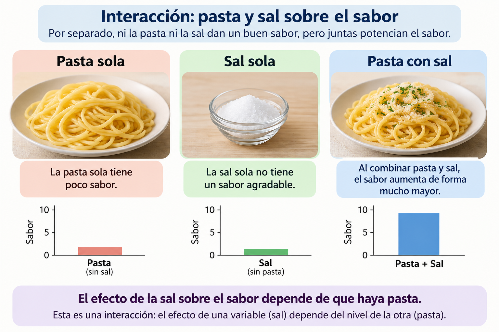
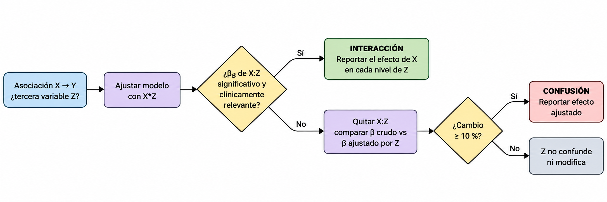

```{r}
#| label: setup
#| include: false
library(ggplot2)
theme_set(theme_minimal(base_size = 14))
data(birthwt, package = "MASS")
data(Pima.tr,  package = "MASS")
birthwt$smoke_f <- factor(birthwt$smoke, labels = c("No fuma", "Fuma"))
```

## Objetivos de aprendizaje

| Bloque | Tema | 
|---|---|---|
| 1 | ¿Qué es una interacción? | 
| 2 | Confusión *vs* interacción | 
| 3 | ¿Por qué incluirla? ¿Qué pasa si la omito? | 
| 4 | ¿Qué indica una interacción significativa? ¿Cómo evaluarla? | 
| 5 | Efectos, gráficas e interpretación | 
| 6 | Ejercicios de práctica | 

Paquetes: `ggplot2`, `emmeans`, `ggeffects` y los datos de `MASS` (`birthwt`, `Pima.tr`).

## Recordatorio: el modelo de regresión múltiple


$$Y = \beta_0 + \beta_1X_1 + \beta_2X_2 + \dots + \beta_kX_k + \varepsilon$$

Las $X$ pueden ser variables básicas **o funciones de ellas**: $\ln(X_1)$, $X_1^2$… o el **producto** $X_1X_2$. Celis plantea, entre los modelos candidatos:

$$Y = \beta_0 + \beta_1X_1 + \beta_2X_2 + \beta_3X_1X_2 + \varepsilon$$

El término $\beta_3X_1X_2$ es el **término de interacción** es el tema de hoy.

Supuestos: existencia, independencia, linealidad, homocedasticidad y normalidad **siguen aplicando** al modelo con interacción.

# 1. ¿Qué es una interacción?

## ¿Qué es una interacción?

<div style="text-align: center;">
  
</div>

## Definición

Existe **interacción** cuando el efecto de una variable independiente sobre $Y$ **depende del nivel** de otra variable independiente.

Reordenando el modelo:

$$Y = \beta_0 + \beta_2X_2 + \underbrace{(\beta_1 + \beta_3X_2)}_{\text{pendiente de } X_1}X_1 + \varepsilon$$

- Sin interacción ($\beta_3 = 0$): la pendiente de $X_1$ es **la misma** para cualquier valor de $X_2$ → líneas **paralelas**.
- Con interacción ($\beta_3 \neq 0$): la pendiente de $X_1$ **cambia** con $X_2$ → líneas **no paralelas**.

Sinónimos según la disciplina: **modificación de efecto** (epidemiología), **moderación** (psicología), **heterogeneidad del efecto** (ensayos clínicos), **G×E / epistasis estadística** (genética).

## Que intente responder la interacción

¿El efecto de X sobre Y cambia dependiendo de Z?

$$Y = \beta_0 + \beta_1X + \beta_2Z + \beta_3XZ + \varepsilon$$

Aplica para: 

```{r eval=FALSE}
lm(Y ~ X * Z, data = datos)
```

Donde `X` y `Z` son **continuas**. El término `X:Z` es el producto de las variables.

```{r eval=FALSE}
lm(PA ~ edad * tratamiento, data = datos)
```

## ¿Modelo aditivo o interacción?

:::: {.columns}

::: {.column width="48%"}

### Modelo aditivo

$$
Y = \beta_0 + \beta_1X + \beta_2Z + \varepsilon
$$

Los efectos de $X$ y $Z$ **se suman**.

$$
\text{Efecto de }X = \beta_1
$$

Por lo tanto, el efecto de $X$ **no cambia** según el valor de $Z$.

> **Pregunta:** ¿X y Z contribuyen independientemente a Y?

:::

::: {.column width="48%"}

### Modelo con interacción

$$
Y = \beta_0 + \beta_1X + \beta_2Z +
\beta_3(XZ) + \varepsilon
$$

El efecto de $X$ ahora depende de $Z$:

$$
\text{Efecto de }X = \beta_1 + \beta_3Z
$$

Si $\beta_3 \neq 0$, el efecto de $X$ **cambia según Z**.

> **Pregunta:** ¿El efecto de X sobre Y depende de Z?

:::

::::

---

## Un ejemplo sencillo

Supongamos que evaluamos el efecto de un **tratamiento** sobre $Y$ en dos grupos.

:::: {.columns}

::: {.column width="48%"}

### Aditivo

| Grupo | Control | Tratamiento | Efecto |
|:--|--:|--:|--:|
| A | 100 | 80 | **−20** |
| B | 110 | 90 | **−20** |

El tratamiento tiene el **mismo efecto**:

$$
-20 = -20
$$

Aunque los grupos son diferentes, el efecto del tratamiento **no depende del grupo**.

$$
Y \sim Tratamiento + Grupo
$$

:::

::: {.column width="48%"}

### Interacción

| Grupo | Control | Tratamiento | Efecto |
|:--|--:|--:|--:|
| A | 100 | 80 | **−20** |
| B | 110 | 105 | **−5** |

Ahora:

$$
-20 \neq -5
$$

El efecto del tratamiento **depende del grupo**.

La diferencia de efectos es:

$$
-20-(-5)=\mathbf{-15}
$$

$$
Y \sim Tratamiento * Grupo
$$

:::

::::

---

## ¿Cómo reconocer una interacción?

:::: {.columns}

::: {.column width="47%"}

### Sin interacción

**Líneas paralelas**

```{r}
#| echo: false
#| fig-align: center
#| out-width: "90%"

library(ggplot2)
library(dplyr)
library(tidyr)

d1 <- data.frame(
  x = rep(c(0, 1), 2),
  y = c(100, 80, 110, 90),
  grupo = rep(c("Grupo A", "Grupo B"), each = 2)
)

ggplot(d1, aes(x, y, group = grupo, linetype = grupo)) +
  geom_line(linewidth = 1.2) +
  geom_point(size = 3) +
  scale_x_continuous(
    breaks = c(0, 1),
    labels = c("Control", "Tratamiento")
  ) +
  labs(x = NULL, y = "Y", linetype = NULL) +
  theme_classic(base_size = 16)
```

El efecto del tratamiento es **constante** entre grupos.

:::

::: {.column width="47%"}

### Con interacción

**Líneas no paralelas**

```{r}
#| echo: false
#| fig-align: center
#| out-width: "90%"

d2 <- data.frame(
  x = rep(c(0, 1), 2),
  y = c(100, 80, 110, 105),
  grupo = rep(c("Grupo A", "Grupo B"), each = 2)
)

ggplot(d2, aes(x, y, group = grupo, linetype = grupo)) +
  geom_line(linewidth = 1.2) +
  geom_point(size = 3) +
  scale_x_continuous(
    breaks = c(0, 1),
    labels = c("Control", "Tratamiento")
  ) +
  labs(x = NULL, y = "Y", linetype = NULL) +
  theme_classic(base_size = 16)
```

El efecto del tratamiento **cambia dependiendo del grupo**.

:::

::::

::: {.callout-important}
## Idea clave

**Interacción = el efecto de una variable depende del valor o nivel de otra variable.**

Las líneas **no necesitan cruzarse** para que exista interacción.
:::
## Interacción algunos ejemplos: 

- **Farmacología:** el efecto de un antihipertensivo sobre la PAS depende de la ingesta de sodio.
- **Epidemiología:** el efecto de la edad materna sobre el peso al nacer depende del tabaquismo (lo veremos con `birthwt`).
- **Genética (G×E):** el efecto de un alelo de riesgo sobre el IMC se atenúa en personas físicamente activas.
- **Clínica:** el efecto del IMC sobre la PAS es mayor en personas de mayor edad (simulación más adelante).

::: callout-note
La pregunta clave es siempre: **¿el efecto de X es el mismo para todos, o depende de quién es la persona?**
:::

# 2. Confusión *vs* interacción

## Dos fenómenos distintos

|  | **Confusión** | **Interacción (modificación de efecto)** |
|---|---|---|
| ¿Qué es? | Un **sesgo**: una tercera variable distorsiona la asociación X–Y | Un **fenómeno real**: el efecto de X difiere según Z |
| Condición | Z se asocia con X **y** con Y, y no es intermedia | El efecto de X sobre Y cambia entre niveles de Z |
| ¿Cómo se detecta? | Comparando $\beta_{crudo}$ vs $\beta_{ajustado}$ (cambio ≳ 10 %) | Término producto $X \times Z$ (o estratificando) |
| Estimadores por estrato | **Similares** entre sí, pero distintos del crudo | **Diferentes** entre estratos |
| ¿Qué hacer? | **Ajustar** (incluir Z) y reportar el efecto ajustado | **Describir**: reportar el efecto de X **en cada nivel** de Z |
| Objetivo | Eliminarla | Entenderla y reportarla |

Una misma variable puede ser confusora, modificadora, ambas o ninguna. **Primero** se evalúa la interacción; si no hay, **después** la confusión.

## Confusión: café, tabaquismo y PAS

El consumo de café se asocia con las PAS

```{r echo=FALSE, fig.align="center"}
set.seed(2026)
n    <- 400
fuma <- rbinom(n, 1, 0.3)
cafe <- pmax(0, round(1 + 2 * fuma + rnorm(n, 0, 1), 1))   # tazas/día
pas  <- 118 + 0 * cafe + 12 * fuma + rnorm(n, 0, 10)        # café: efecto real = 0
d_conf <- data.frame(pas, cafe, fuma = factor(fuma, labels = c("No fuma", "Fuma")))

d_conf |> ggplot(aes(cafe, pas)) +
  geom_point(alpha = 0.4) +
  geom_smooth(method = "lm", se = FALSE,
              colour = "black", linetype = 2) +
  labs(x = "Café (tazas/día)", y = "PAS (mmHg)",
       colour = NULL,
       caption = "Línea punteada = modelo crudo") +
  theme(legend.position = "top")
```


## Confusión: café, tabaquismo y PAS

El tabaquismo aumenta el consumo de café **y** la PAS. El café **no** tiene efecto real.

```{r echo=FALSE, fig.align="center"}
d_conf |> ggplot(aes(cafe, pas)) +
  geom_point(aes(colour = fuma), alpha = 0.4) +
  geom_smooth(method = "lm", se = FALSE,
              colour = "black", linetype = 2) +
  geom_smooth(aes(colour = fuma),
              method = "lm", se = FALSE) +
  labs(x = "Café (tazas/día)", y = "PAS (mmHg)",
       colour = NULL,
       caption = "Línea punteada = modelo crudo") +
  theme(legend.position = "top")
```


## Confusión: café, tabaquismo y PAS

El tabaquismo aumenta el consumo de café **y** la PAS. El café **no** tiene efecto real.

Asi cambian los coeficientes de café en los modelos crudo y ajustado:

```{r}

crudo    <- lm(pas ~ cafe, data = d_conf)
ajustado <- lm(pas ~ cafe + fuma, data = d_conf)
interac  <- lm(pas ~ cafe * fuma, data = d_conf)

c(crudo = coef(crudo)["cafe"], ajustado = coef(ajustado)["cafe"])
summary(interac)$coefficients["cafe:fumaFuma", ]
```

- Crudo ≈ 3.3 mmHg/taza (¡"significativo"!) → ajustado ≈ 0.4: cambio ≫ 10 % → **confusión**.
- Término `cafe:fumaFuma` no significativo → **no hay interacción**.

## Así se ve la confusión

```{r}
#| output-location: column
#| fig-width: 5
#| fig-height: 5
ggplot(d_conf, aes(cafe, pas)) +
  geom_point(aes(colour = fuma), alpha = 0.4) +
  geom_smooth(method = "lm", se = FALSE,
              colour = "black", linetype = 2) +
  geom_smooth(aes(colour = fuma),
              method = "lm", se = FALSE) +
  labs(x = "Café (tazas/día)", y = "PAS (mmHg)",
       colour = NULL,
       caption = "Línea punteada = modelo crudo") +
  theme(legend.position = "top")
```

- Dentro de cada estrato las líneas son **planas y paralelas** (sin efecto, sin interacción).
- La línea cruda sube solo porque los fumadores toman más café y tienen PAS más alta.

# ¿Qué hacer con la confusión?

## Si el ajuste "elimina" el efecto de X, ¿quitamos Z?

:::: {.columns}

::: {.column width="48%"}

### Modelo crudo

$$
Y = \beta_0 + \beta_1X + \varepsilon
$$

Supongamos que observamos:

$$
\beta_X = 2.5
$$

Existe una asociación aparente entre $X$ y $Y$.

```text
Y
│          /
│        /
│      /
│    /
│  /
└──────────── X
```

**Conclusión cruda:**

> Al aumentar X, aumenta Y.

:::

::: {.column width="48%"}

### Modelo ajustado por Z

$$
Y = \beta_0 + \beta_1X + \beta_2Z + \varepsilon
$$

Después del ajuste:

$$
\beta_X = 0.3
$$

La asociación se **atenúa considerablemente**.

```text
Y
│
│       ─────────
│
│
│
└──────────── X
```

**¿Debemos eliminar Z?**

### **NO**

Si $Z$ es un confusor, debe permanecer en el modelo.

:::

::::

::: {.callout-important}
## El cambio en el efecto de X es precisamente lo que queremos detectar

Si el efecto crudo desaparece después de controlar un **confusor verdadero**, la interpretación es que la asociación original estaba **confundida**, no que debamos retirar el ajuste.
:::

---

## ¿Por qué Z cambia el efecto de X?

No toda variable que modifica $\beta_X$ es necesariamente un **confusor**.

:::: {.columns}

::: {.column width="32%"}

### Confusión

$$
Z \rightarrow X
$$

$$
Z \rightarrow Y
$$

Z explica parte de la asociación observada entre X e Y.

**¿Ajustar por Z?**

### **Sí ✓**

Aunque:

- $\beta_X$ disminuya
- $p_X > 0.05$
- la asociación desaparezca

:::

::: {.column width="32%"}

### Mediación

$$
X \rightarrow Z \rightarrow Y
$$

Z se encuentra en la vía causal entre X e Y.

**¿Ajustar por Z?**

### **Depende ⚠️**

Si buscamos el **efecto total** de X:

**NO**

Si buscamos el **efecto directo** de X:

puede ser necesario.

:::

::: {.column width="32%"}

### Interacción

El efecto de X cambia dependiendo de Z:

$$
Y = \beta_0+\beta_1X+\beta_2Z+
\beta_3XZ+\varepsilon
$$

$$
\text{Efecto de X} =
\beta_1+\beta_3Z
$$

**¿Incluir Z?**

### **Sí ✓**

Pero también debemos incluir:

$$
X\times Z
$$

y reportar efectos específicos.

:::

::::

::: {.callout-tip}
## Regla práctica

**No elimine una variable porque haga que X pierda significancia.**

Primero pregunta qué papel tiene $Z$:

**¿Confusor, mediador o modificador del efecto?**
:::


## Confusión: helados y ahogamientos

:::: {.columns}

::: {.column width="45%"}

### Asociación observada

Durante los meses con mayor venta de helados también se registran más ahogamientos.

$$
\text{Helados} \longrightarrow \text{Ahogamientos}
$$

¿Significa que consumir helado **aumenta el riesgo de ahogamiento**?

### No necesariamente

Existe una tercera variable:

$$
\boxed{\text{Temperatura / Verano}}
$$

:::

::: {.column width="55%"}

### El confusor explica la asociación

$$
\text{Helados}
\longleftarrow
\boxed{\text{Temperatura}}
\longrightarrow
\text{Actividades acuáticas}
\longrightarrow
\text{Ahogamientos}
$$

Cuando aumenta la temperatura:

- aumenta el consumo de helados
- aumenta la exposición a actividades acuáticas

Por lo tanto, debemos **ajustar por temperatura/temporada** para estimar la asociación independiente:

$$
Y = \beta_0 + \beta_1(\text{Helados}) +
\beta_2(\text{Temperatura}) + \varepsilon
$$

:::

::::

::: {.callout-important}
Si al ajustar por temperatura la asociación entre helados y ahogamientos **disminuye o desaparece**, esto es compatible con que la asociación cruda estaba **confundida**.
:::

---

## Confusión: encendedor y cáncer de pulmón

:::: {.columns}

::: {.column width="45%"}

### Asociación observada

Un estudio encuentra que las personas que llevan encendedor presentan mayor riesgo de cáncer de pulmón.

$$
\text{Encendedor} \longrightarrow \text{Cáncer}
$$

Por ejemplo:

$$
\beta = 2.4,\qquad p < 0.001
$$

¿El encendedor causa cáncer?

### No

Falta considerar una variable:

$$
\boxed{\text{Tabaquismo}}
$$

:::

::: {.column width="55%"}

### El tabaquismo es un confusor

$$
\text{Encendedor}
\longleftarrow
\boxed{\text{Tabaquismo}}
\longrightarrow
\text{Cáncer de pulmón}
$$

El tabaquismo está relacionado con:

- llevar un encendedor
- desarrollar cáncer de pulmón

Después de ajustar:

$$
Y = \beta_0 +
\beta_1(\text{Encendedor}) +
\beta_2(\text{Tabaquismo}) + \varepsilon
$$

podríamos obtener:

$$
\beta_{\text{Encendedor}} = 0.1,\qquad p=0.74
$$

:::

::::

::: {.callout-important}
**No eliminamos tabaquismo porque haga desaparecer el efecto.**

Si es un confusor, debe permanecer en el modelo. El objetivo del ajuste es obtener una estimación **menos sesgada**, no conservar la significancia de $X$.
:::

## Guía de decisión

<div style="text-align: center;">
  
</div>

# 3. ¿Por qué incluir una interacción? ¿Qué pasa si la omito?

## Omitir una interacción real sesga los efectos simples

Si los datos se generan con $Y=\beta_0+\beta_1X+\beta_2Z+\beta_3XZ+\varepsilon$ y ajustamos solo $Y \sim X + Z$, Rimpler et al. (2025) muestran que lo que en realidad estimamos es:

$$b_1 = \beta_1 + \beta_3\,\mu_Z \qquad\qquad b_2 = \beta_2 + \beta_3\,\mu_X$$

El efecto "simple" absorbe la interacción multiplicada **por la media de la otra variable**. Consecuencias:

- El efecto puede **inflarse** (interacción sinérgica).
- Puede **desaparecer** ($b_1 \approx 0$) aunque $\beta_1 \neq 0$.
- Puede **invertir su signo** (interacción antagónica).

Además, los residuales ya no son independientes ni homocedásticos → los valores *p* del modelo mal especificado **no son confiables**.

## Forma de la interacción (Rimpler et al., 2025)

| Tipo | Signos | Ejemplo en salud | Si la omito… |
|---|---|---|---|
| **Sinérgica** | $\beta_1, \beta_2, \beta_3$ mismo signo | Tabaquismo + exposición a asbesto → riesgo pulmonar mayor que la suma | Efectos simples inflados; el modelo simple "funciona" razonablemente |
| **Amortiguadora** | $\beta_1$ y $\beta_2$ con signos opuestos | Estrés laboral (+PAS) amortiguado por actividad física (−PAS) | Sesgo intermedio |
| **Antagónica** | Efectos simples opuestos a $\beta_3$ | Dos fármacos que bajan la PA, pero juntos menos que la suma (efecto techo) | Efectos que **desaparecen o se invierten** → conclusiones erróneas |


## Entonces… ¿siempre incluirla? El costo

Rimpler et al. (55 millones de análisis simulados) encontraron:

- El modelo con interacción **sobreajusta más** la muestra cuando *n* es pequeño o cuando no hay interacción real.
- Pero, en la población, el modelo correcto (con interacción) **casi siempre generaliza mejor** cuando la interacción existe.
- El modelo simple solo gana cuando la interacción es nula o sinérgica **y** *n* es pequeño.
- Las interacciones suelen ser pequeñas: requieren **mucha más muestra** que los efectos principales.

::: callout-tip
**Regla práctica:** la decisión de evaluar una interacción debe venir de la **teoría / hipótesis biológica**, planearse *a priori* y justificarse.
:::

## El modelo ideal

### Un modelo ideal debería ser:

#### Sencillo
#### Interpretativo
#### Biológicamente plausible
#### Incluir confusoras
#### Incluir interacciones relevantes

# 4. ¿Qué indica una interacción significativa? ¿Cómo evaluarla?

## ¿Qué significa que $\beta_3$ sea significativo?

$H_0: \beta_3 = 0$ (las pendientes son iguales; líneas paralelas)  
$H_1: \beta_3 \neq 0$ (la pendiente de $X_1$ cambia con $X_2$)

Si se rechaza $H_0$:

1. **No existe un único efecto de $X_1$**: hay que reportarlo **condicionado** a $X_2$.
2. Los coeficientes $\beta_1$ y $\beta_2$ **dejan de ser "efectos principales"**: son efectos **condicionales** cuando la otra variable vale **0**.
3. Se respeta el **principio de jerarquía**: si $X_1X_2$ está en el modelo, $X_1$ y $X_2$ también, **sean o no significativos**.

Significancia estadística ≠ relevancia clínica: evalúe también la **magnitud** de la diferencia de pendientes y su IC 95 %.

## Cómo evaluarla: pasos

1. **Hipótesis a priori**: ¿hay razón biológica para que Z modifique el efecto de X?
2. **Explorar**: gráfico de dispersión por estratos / líneas de regresión por grupo.
3. **Ajustar** el modelo sin y con interacción: `y ~ x + z` vs `y ~ x * z`.
4. **Probar**:
   - Un solo término → prueba *t* de $\beta_3$.
   - Varios términos (p. ej. factor con >2 niveles) → **prueba F parcial**: `anova(m_sin, m_con)`.
5. **Complementar**: $R^2$ ajustado, AIC, tamaño de la diferencia de pendientes.
6. **Diagnóstico** del modelo final (residuales, homocedasticidad, influencia).
7. **Interpretar y graficar** efectos condicionales (pendientes simples).

En la fórmula de R: `x * z` equivale a `x + z + x:z`; `x:z` es solo el producto.

## Ejemplo con `birthwt` edad materna × tabaquismo

¿El efecto de la edad materna sobre el peso al nacer (g) depende del tabaquismo?

```{r}
m_sin <- lm(bwt ~ age + smoke_f, data = birthwt)
m_con <- lm(bwt ~ age * smoke_f, data = birthwt)
round(summary(m_con)$coefficients, 3)
anova(m_sin, m_con)        # prueba F parcial (aquí equivale a la t de β3)
```

$\beta_3 = -46.6$ g, *p* = 0.024 → la pendiente de la edad **difiere** entre fumadoras y no fumadoras.

# 5. Efectos, gráficas e interpretación

## Leer los coeficientes con interacción

$$\widehat{bwt} = 2406.1 + 27.7\,\text{edad} + 798.2\,\text{Fuma} - 46.6\,(\text{edad}\times\text{Fuma})$$

| Coeficiente | Valor | Significado **correcto** |
|---|---|---|
| Intercepto | 2406 | Peso esperado en no fumadora de **0 años** (sin sentido) |
| `age` | 27.7 | Pendiente de la edad **en no fumadoras** |
| `smoke_fFuma` | 798.2 | Diferencia Fuma − No fuma **a los 0 años** (¡no es "fumar aumenta el peso"!) |
| `age:smoke_fFuma` | −46.6 | **Diferencia de pendientes** (Fuma − No fuma) |

Pendiente en fumadoras = $27.7 + (-46.6) = -18.8$ g por año.

::: callout-warning
Interpretar `smoke_fFuma = +798` como efecto del tabaquismo es el error más común. Con interacción, ese coeficiente depende de dónde está el 0 de la otra variable.
:::

## Interacción: tabaquismo × edad materna

Evaluamos si la asociación entre **edad materna** y **peso al nacer** depende del tabaquismo.

$$
bwt = \beta_0 + \beta_1 smoke + \beta_2 age +
\beta_3(smoke \times age) + \varepsilon
$$

```{r}
#| echo: true
modelo <- lm(bwt ~ smoke * age, data = birthwt)
summary(modelo)
```

## Interacción: tabaquismo × edad materna

:::: {.columns}

::: {.column width="48%"}

### No fumadoras

Cuando $smoke=0$:

$$
\widehat{bwt}=2406.06+27.73(age)
$$

Por tanto:

$$
\boxed{\text{Pendiente}=+27.73\text{ g/año}}
$$

Por cada año adicional de edad materna, el peso esperado aumenta **27.7 g**.

:::

::: {.column width="48%"}

### Fumadoras

Cuando $smoke=1$:

$$
\widehat{bwt}=3204.23-18.84(age)
$$

Por tanto:

$$
\boxed{\text{Pendiente}=-18.84\text{ g/año}}
$$

Por cada año adicional de edad materna, el peso esperado disminuye **18.8 g**.

:::

::::

---

## ¿Dónde está la interacción?

El coeficiente de interacción es:

$$
\boxed{\beta_{smoke:age}=-46.57,\qquad p=0.024}
$$

:::: {.columns}

::: {.column width="48%"}

### ¿Qué significa −46.57?

Es la **diferencia entre las pendientes**:

$$
-18.84-(27.73)=-46.57
$$

| Grupo | Pendiente |
|:--|--:|
| No fumadoras | +27.73 g/año |
| Fumadoras | −18.84 g/año |
| **Diferencia** | **−46.57 g/año** |

:::

::: {.column width="48%"}

### Interpretación

La asociación entre edad materna y peso al nacer **depende del tabaquismo**.

$$
\boxed{
\text{Efecto de edad}
=
\beta_{age}+
\beta_{smoke:age}(smoke)
}
$$

Las pendientes son diferentes:

- No fumadoras: **positiva**
- Fumadoras: **negativa**

Por tanto, el modelo **no es aditivo**.

:::

::::

::: {.callout-important}

## Interacción

Una interacción significativa no significa simplemente que ambas variables sean importantes.

**Significa que el efecto de una variable cambia dependiendo de la otra.**
:::

---

## Cuidado con los efectos principales

El modelo estima:

$$
\beta_{smoke}=798.17,\qquad p=0.101
$$

¿Significa que fumar aumenta el peso al nacer en **798 g**?

### **No**

:::: {.columns}

::: {.column width="48%"}

Con una interacción:

$$
\text{Efecto de smoke}
=
\beta_{smoke}+
\beta_{smoke:age}(age)
$$

Por tanto:

$$
\text{Efecto de smoke}
=
798.17-46.57(age)
$$

El coeficiente $\beta_{smoke}=798.17$ representa el efecto del tabaquismo cuando:

$$
age=0
$$

**Una edad sin interpretación práctica.**

:::

::: {.column width="48%"}

### Solución: centrar la edad

Por ejemplo, a los **25 años**:

$$
age_c=age-25
$$

```{r}
birthwt <- birthwt |>
  mutate(age_c = age - 25)

modelo_c <- lm(
  bwt ~ smoke * age_c,
  data = birthwt
)
```

Ahora $\beta_{smoke}$ representa la diferencia entre fumadoras y no fumadoras **a los 25 años**:

$$
798.17-46.57(25)
$$

$$
\boxed{\approx -366\text{ g}}
$$

:::

::::

::: {.callout-tip}

## ¿Qué cambia al centrar?

**No cambia la interacción ni el ajuste del modelo.**

Cambia el punto de referencia y hace que los **efectos principales sean interpretables**.
:::
## Pendientes simples con IC 95 %: truco de `relevel()`

El coeficiente de `age` siempre es la pendiente en la **categoría de referencia**. Cambiando la referencia obtenemos la pendiente (y su IC) en el otro grupo:

```{r}
m_ref_fuma <- lm(bwt ~ age * relevel(smoke_f, ref = "Fuma"), data = birthwt)

rbind(
  "No fuma" = c(coef(m_con)["age"],      confint(m_con)["age", ]),
  "Fuma"    = c(coef(m_ref_fuma)["age"], confint(m_ref_fuma)["age", ])
) |> round(1)
```

- No fumadoras: +27.7 g por año de edad (IC 95 % 3.8 a 51.7).
- Fumadoras: −18.8 g por año (IC 95 % −51.3 a 13.6).

## Centrar para que los coeficientes tengan sentido

```{r}
birthwt$age_c <- birthwt$age - mean(birthwt$age)    # media = 23.2 años
m_cen <- lm(bwt ~ age_c * smoke_f, data = birthwt)
round(summary(m_cen)$coefficients, 3)
```

- `smoke_fFuma` ahora = **−284 g**: diferencia por tabaquismo **a la edad promedio** (23 años), *p* = 0.008.
- $\beta_3$, su EE, su *p* y el $R^2$ **no cambian**.
- Centrar **no "arregla" la colinealidad** de la interacción (no la necesita): solo mejora la **interpretación** (Rimpler et al., 2025).

## Gráfica: categórica × continua

```{r}
#| output-location: column
#| fig-width: 5
#| fig-height: 5
ggplot(birthwt, aes(age, bwt, colour = smoke_f)) +
  geom_point(alpha = 0.5) +
  geom_smooth(method = "lm", se = TRUE) +
  labs(x = "Edad materna (años)",
       y = "Peso al nacer (g)",
       colour = NULL) +
  theme(legend.position = "top")
```

- Líneas **no paralelas** que se **cruzan** → interacción cualitativa (cruzada).
- Con un factor de 2 niveles, `geom_smooth()` por grupo traza las mismas rectas que el modelo `bwt ~ age * smoke_f`.
- Note la poca precisión en edades extremas: no extrapolar.


## Diagnóstico del modelo con interacción

El modelo con interacción sigue siendo un modelo lineal: los supuestos de Celis se verifican igual.

```{r}
#| output-location: column
#| fig-width: 5
#| fig-height: 5
par(mfrow = c(2, 2), mar = c(4, 4, 2, 1))
plot(m_con)
```

```{r}
#| eval: false
# Alternativa usada en el curso:
performance::check_model(m_con)
```

## Cómo reportar una interacción

> "Se observó una interacción entre la edad materna y el tabaquismo sobre el peso al nacer ($\beta_3 = -46.6$ g; IC 95 % −86.9 a −6.2; *p* = 0.024). En las no fumadoras, cada año adicional de edad se asoció con un aumento de 27.7 g (IC 95 % 3.8 a 51.7), mientras que en las fumadoras la asociación fue negativa y no significativa (−18.8 g; IC 95 % −51.3 a 13.6). A la edad promedio (23 años), los hijos de fumadoras pesaron 284 g menos (*p* = 0.008)."

Elementos: (1) existencia de la interacción con IC; (2) efecto de X **en cada nivel** de Z; (3) efecto de Z en un valor **con sentido** de X; (4) gráfica.

## Errores comunes

- ❌ Interpretar $\beta_1$ o $\beta_2$ como "efectos principales" cuando hay interacción.
- ❌ Quitar $X_1$ o $X_2$ porque "no son significativos" (viola la jerarquía).
- ❌ Centrar "para eliminar la colinealidad" y creer que cambió la interacción.
- ❌ Probar todas las interacciones posibles sin hipótesis (falsos positivos, sobreajuste).
- ❌ Concluir "no hay interacción" con *n* pequeño (poco poder ≠ ausencia de efecto).
- ❌ Confundir confusión con interacción: la confusión se **ajusta**, la interacción se **describe**.
- ❌ Extrapolar las pendientes simples fuera del rango observado.

# 6. Ejercicios de práctica

## Ejercicio 1 — `Pima.tr`: edad × diabetes sobre la presión diastólica

```{r}
#| eval: false
data(Pima.tr, package = "MASS")   # bp = presión diastólica; type = diabetes (No/Yes)
```

a) Grafique `bp` vs `age` con una recta por `type`. ¿Las rectas son paralelas?  
b) Ajuste `bp ~ age + type` y `bp ~ age * type`. Compárelos con `anova()`.  
c) Interprete cada coeficiente del modelo con interacción. ¿Qué significa el coeficiente de `typeYes`?  
d) Calcule la pendiente de la edad en cada grupo (con IC 95 %) usando `relevel()`.  
e) Centre `age` y vuelva a ajustar. ¿Qué cambió y qué no?  
f) Redacte un párrafo de resultados.

## Ejercicio 2 — `birthwt`: peso materno × tabaquismo

a) Ajuste `bwt ~ lwt * smoke_f` (`lwt` = peso materno en libras).  
b) ¿La interacción es significativa? ¿Qué decisión toma sobre el modelo final?  
c) Si retira la interacción, ¿cómo interpreta ahora el coeficiente de `smoke_f`?  
d) Haga la gráfica de rectas por grupo. ¿Coincide con su conclusión?

## Ejercicio 3 — Datos Bio3_24a (Celis, cuadro 24-1)

```{r}
#| eval: false
bio3_24a <- data.frame(
  x1 = c(0, 0, 0, 0, 0, 1, 1, 1, 2, 2, 2),
  x2 = c(0.28, 1.85, 3.73, 7.62, 8.12, 2.07, 2.09, 5.76, 5.83, 8.94, 9.39),
  y  = c(1.04, 2.30, 4.39, 9.49, 8.28, 4.85, 4.91, 7.44, 8.20, 11.04, 12.72))
```

a) Ajuste los modelos de Celis $Y \sim X_1 + X_2$ y $Y \sim X_1 + X_2 + X_1X_2$.  
b) ¿El término de interacción mejora el modelo (prueba F parcial, $R^2$ ajustado)?  
c) Con *n* = 11, ¿qué puede y qué no puede concluir sobre la ausencia de interacción?

## Ejercicio 4 — ¿Confusión o interacción?

```{r}
#| eval: false
set.seed(42); n <- 300
# Base A
sexo <- rbinom(n, 1, 0.5)
act  <- pmax(0, round(3 + 2*sexo + rnorm(n, 0, 1.5), 1))       # actividad física (h/sem)
ldl  <- 120 + 20*sexo - 2*act + rnorm(n, 0, 12)
base_A <- data.frame(ldl, act, sexo = factor(sexo, labels = c("Mujer", "Hombre")))
# Base B
sexo <- rbinom(n, 1, 0.5)
act  <- pmax(0, round(4 + rnorm(n, 0, 1.5), 1))
ldl  <- 130 - 4*act*(1 - sexo) + rnorm(n, 0, 12)
base_B <- data.frame(ldl, act, sexo = factor(sexo, labels = c("Mujer", "Hombre")))
```

Para cada base: ajuste `ldl ~ act`, `ldl ~ act + sexo` y `ldl ~ act * sexo`; grafique por sexo y use la **guía de decisión** para clasificar el papel del sexo. ¿Qué ocurre con el signo del efecto crudo en la base A?


# 7. Interacciones con variables cuantitativas 

# 8. Ejercicios de interaccioes con variables cuantitativas

# 9. Resumen y conclusiones

## Resumen

1. Interacción = **el efecto de X depende de Z**; matemáticamente, pendiente de $X_1$ = $\beta_1 + \beta_3X_2$.
2. **Confusión** es un sesgo que se ajusta; **interacción** es un hallazgo que se describe por estratos.
3. Omitir una interacción real puede **anular o invertir** efectos verdaderos (sobre todo si es antagónica).
4. Con interacción, $\beta_1$ y $\beta_2$ son efectos **condicionales** (en 0 de la otra variable): **centre** para interpretarlos.
5. Evalúe con *t* de $\beta_3$ o F parcial, respete la **jerarquía**, grafique **pendientes simples** y reporte efectos por nivel.
6. La decisión de incluirla nace de la **teoría**, no de la búsqueda de significancia.

## Referencias

- Celis de la Rosa, A. J., & Labrada Martagón, V. (2014). *Bioestadística* (3ª ed.). Editorial El Manual Moderno. Caps. 23 (Regresión y correlación simple) y 24 (Regresión y correlación múltiple).
- Denis, D. J. (2020). *Univariate, Bivariate, and Multivariate Statistics Using R*, cap. 7. Wiley.
- Rimpler, A., Kiers, H. A. L., & van Ravenzwaaij, D. (2025). To interact or not to interact: The pros and cons of including interactions in linear regression models. *Behavior Research Methods*, 57, 92. <https://doi.org/10.3758/s13428-025-02613-6>
- Penn State Eberly College of Science. *STAT 462: Applied Regression Analysis*, 7.6 Interactions Between Quantitative Predictors. <https://online.stat.psu.edu/stat462/node/157/>
- Hosmer, D. W., & Lemeshow, S. (1989). *Applied Logistic Regression*. Wiley (origen de `birthwt`). Venables & Ripley (2002), *MASS*.
